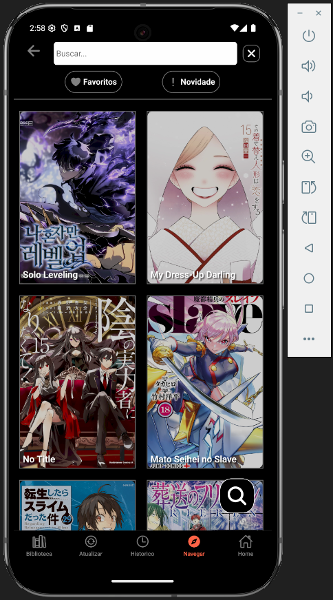

# MReader
Leitor de quadrinhos criado em React Native com Expo (em Desenvolvimento)

- O APk completo pode ser baixado [aqui](https://github.com/Igor-Wolf/MReader/releases/download/v0.8/MReader.apk).

## Sobre o desenvolvimento

Sobre o desenvolvimento sempre que buildar lembrar de configurar o arquivo abaixo para não ter problemas de exibição no android na fonte correspondente:

android\app\src\main\res\xml\network_security_config.xml

<?xml version="1.0" encoding="utf-8"?>
<network-security-config>
    <domain-config cleartextTrafficPermitted="true">
        <domain includeSubdomains="true">static.hq-now.com</domain>
    </domain-config>
</network-security-config>

e adicionar no android\app\src\main\AndroidManifest.xml

android:networkSecurityConfig="@xml/network_security_config"

